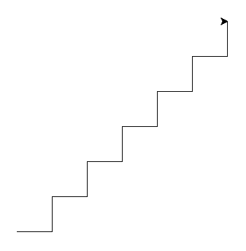

# 🐍 🐢

In this lesson, we will be drawing with the [ColabTurtle](https://github.com/tolgaatam/ColabTurtle) module a lot.

> [note]
> In the older versions of the materials, we have used the turtle module
> which is available in for every Python installation
> but more and more Mac users started to have unfixable issues with it
> so we have decided to switch to ColabTurtle that we also use for the homework
> for this lesson.

Start the Google Colab with a newly created notebook and install and initialize the ColabTurtle in a following way.

First run this line in a first cell:

```console
!pip3 install ColabTurtle
```

This will install the ColabTurtle module inside your colab environment for this lesson.
You need to do it once in every colab notebook, where you want to use it. You also need to run this cell if you close and open this colab notebook again.

When this is done, you can import all functions from ColabTurtle module using this:

```python
from ColabTurtle.Turtle import initializeTurtle, forward
```

Don't worry, we will talk about the possible ColabTurtle functions throughout the lesson.

Before you start using any turtle commands in a new cell, you need to initialize it by typing this:

```python
initializeTurtle()
```

Initialization means that a fresh canvas window is created below the current cell, turtle image is rotated with a head north and you can start drawing!

Try moving the turtle forward by 50 units (screen pixels) by running following in a new cell:

```python
forward(50)
```

You can see that a new canvas is drawn below the current cell and the turtle is leaving a drawn line behind itself with length 50.

## Rotation

In order to clear the canvas for next drawing, you need to call the `initializeTurtle()` again.

The turtle can rotate and crawl across the "paper".

```python
from ColabTurtle.Turtle import forward, left, right, initializeTurtle
initializeTurtle()

forward(50)
left(60)
forward(50)
right(60)
forward(50)
```

This is already really powerful way how to draw a lot of beautiful pictures.

For the further steps you can freely consult the ColabTurtle API description (what each available function does and what parameters does each function have) on [https://github.com/tolgaatam/ColabTurtle#api](https://github.com/tolgaatam/ColabTurtle?tab=readme-ov-file#api).

### Square

Draw a square.


A square has four equal straight sides and four 90° angles.


```python
from ColabTurtle.Turtle import forward, left, initializeTurtle
initializeTurtle()
forward(50)
left(90)
forward(50)
left(90)
forward(50)
left(90)
forward(50)
left(90)
```


### Rectangle

Draw a rectangle.

Try to make it so that the turtle will "look" to the top in the end (like it was in the beginning).



```python
from ColabTurtle.Turtle import forward, left, initializeTurtle
initializeTurtle()
forward(100)
left(90)
forward(50)
left(90)
forward(100)
left(90)
forward(50)
left(90)

```


### Three squares

Now draw three squares, each rotated by 20° from the previous one!.



```python
from ColabTurtle.Turtle import forward, left, initializeTurtle
initializeTurtle()

forward(50)
left(90)
forward(50)
left(90)
forward(50)
left(90)
forward(50)
left(90)

left(20)

forward(50)
left(90)
forward(50)
left(90)
forward(50)
left(90)
forward(50)
left(90)

left(20)

forward(50)
left(90)
forward(50)
left(90)
forward(50)
left(90)
forward(50)
left(90)

```


### Can we write it better?

So much code! There has to be a way how to simplify it.

There is.
Now we will learn the command `for`.

## Repetition

What does the following code do?

```python
for number in range(5):
    print(number)

for greeting in 'Ahoj', 'Hello', 'Hola', 'Hei', 'Hallo':
    print(greeting + '!')
```

What does the command `for` do?


The command `for` repeats part of a program.
It repeats commands that are indented after `for`.
It's the same as with `if` - it applies only to
commands that are indented below.

The command `for x in range(n):` repeats the commands below <var>n</var> times
and it increments the variable `x` gradually from <var>0 to n-1</var>.

The command `for x in a, b, c, d, ...:` repeats the commands below;
it changes the variable `x` gradually to <var>a</var>, <var>b</var>,
<var>c</var> <var>d</var>, ...

In computer programming, a loop is a sequence of instructions that is continually repeated until a condition is reached.
Very powerful concept allowing you to significantly reduce duplication of commands.



### Overwriting variables

What does the following program do?

```python
sum = 0
# lets print how the sum is initialized before the loop starts
print("sum is", sum)
for number in 8, 45, 9, 21:
    # internal variable inside the loop is number
    print("number is", number)
    sum = sum + number
    # sum variable is holding the temporary sum of values
    print("sum is", sum)
print('loop ended, sum is', sum)
```


The command `sum = sum + number` calculates the value of
`sum + number`, adds the current number to the sum,
and stores the result in the variable `sum`.
The new value of `sum` will be used in the next loop.

In the beginning the sum is 0, and in the end the sum of
our numbers will be printed.


### Square

Back to drawing! This time we will use loops.

Draw a square.

Use `forward` only twice, once in the import
and once as function.



```python
from ColabTurtle.Turtle import forward, left, initializeTurtle
initializeTurtle()

for i in range(4):
    forward(50)
    left(90)
```


### Discontinuous line

The functions `penup` and `pendown` from the `ColabTurtle`
module tell the turtle to stop/start drawing.

Try to draw a discontinuous line.



```python
from ColabTurtle.Turtle import forward, penup, pendown, initializeTurtle
initializeTurtle()
for i in range(10):
    forward(10)
    penup()
    forward(5)
    pendown()

```


Now try to make it so that the lines that are drawn become
gradually bigger.

![Turtle and discontinuous line]](static/turtle-dashed2.png)

> [note] Help
>
> What exactly does the command `for` do?
> Can we use the variable that it sets up?


```python
from ColabTurtle.Turtle import forward, penup, pendown, right, initializeTurtle, speed
initializeTurtle()
speed(5)
right(90) # so that the drawing still fits into the canvas
for i in range(20):
    forward(i)
    penup()
    forward(5)
    pendown()

```


>[note] Loop variable Naming
>Always use a meaningful loop variable name, like **for index_tab_browser in range(3, 18): close_tab_in_browser(index_tab_browser) ** not just i, j, x, y etc.
>When using meaningful names:
> - the code is more understandable to colleagues reading your code,
> - it's easier to find errors in the loop logic
> - text searches for the variable name return relevant pieces of code operating on the same data are more reliable
>
> There is one exception - when it's a single-level loop and the variable has no meaning other than "the number of times I've been through this loop", in which case `i` is usually be used.

### Three squares

Finally, draw three squares, each rotated by 20°.
Now you know how to write it in a simple way: repeat the code
by using `for`, do not copy the same code three times.



```python
from ColabTurtle.Turtle import forward, left, initializeTurtle
initializeTurtle()
for i in range(3):
    for j in range(4):
        forward(50)
        left(90)
    left(20)
```



## Extra tasks

When you are done, try to draw stairs:



When you are also done with the stairs, try to draw 7 hexagons:


