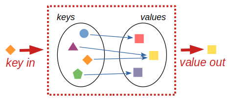

# Dictionaries

Let's learn about another Python basic (*mutable*) data type -
*dictionary*, or short, `dict`.

Dictionary is a data structure consisting of multiple *key/value* pairs,
mapping *keys* to their corresponding *values*.



Its main purpose is to find quickly and efficiently a value for a given key.

Python constraints what dictionary *keys* can be.
The keys must not repeat (one key cannot map to two different values)
and must not be changeable (*mutable* values, such as lists and dictionaries
are therefore not allowed). Strings keys are the most common, though other
types such as numbers and tuples are also used.

The target *values*, as in the case of, e.g., lists, can by anything
which can be assigned to a variable. The values can repeat and multiple
keys can point to a same value.

Enough abstract talking, let's move to an example. This is a dictionary with
3 keys, and each one of them has a value:

```pycon
>>> record = {'name': 'Peggy', 'city': 'Prague', 'numbers': [20, 8]}
>>> record
{'name': 'Peggy', 'city': 'Prague', 'numbers': [20, 8]}
```

Note the curly braces `{}` and the colons `:` between each key and value.
The key/value pairs are separated by commas `,`.

> [note]
> **Are dictionaries ordered?**
> As of [Python 3.7](https://docs.python.org/3/whatsnew/3.7.html)
> officially (effectively
> [already from Python 3.6](https://docs.python.org/3/whatsnew/3.6.html#new-dict-implementation))
> dictionaries are gurateed to preserve order in which their key/values pairs
> are inserted. Before, the ordering was not guaranteed, as it can be still
> found mentioned in older text books.

You can get values from the dictionary similar as
from lists, but instead of an index, you have to use e key.

```pycon
>>> record['name']
'Peggy'
```

If you try to access a non-existent key, Python won't like it:

```pycon
>>> record['age']
Traceback (most recent call last):
  File "<stdin>", line 1, in &lt;module&gt;
KeyError: 'age'
```

You can change the values of keys:

```pycon
>>> record['numbers'] = [20, 8, 42]
>>> record
{'name': 'Peggy', 'city': 'Prague', 'numbers': [20, 8, 42]}
```

... or add keys and values:

```pycon
>>> record['language'] = 'Python'
>>> record
{'name': 'Peggy', 'city': 'Prague', 'numbers': [20, 8, 42], 'language': 'Python'}
```

... or delete keys and values using the `del` command (also the same as for lists):

```pycon
>>> del record['numbers']
>>> record
{'name': 'Peggy', 'city': 'Prague', 'language': 'Python'}
```

Dictionaries in Python have a couple of useful methods which are good to know.

One of them is the `get` method which allows you to get a value for a key
when the key exists or return a default value when it does not exist:

```pycon
>>> record.get('name') # key exits and value is returned
'Peggy'
>>> record.get('age') # key does not exist and None is returned instead
>>> record.get('age', 'n/a') # key does not exist and 'n/a' is returned instead
'n/a'
```

Sometimes, we use the `get` method with the same value for the key and the
defaut value which is useful for substitutions (values not found in the
dictionary are passed unchanged, values found in the dictionary are replaced)

```pycon
>>> values = ["A", "B", None, "D"]
>>> subtitution = {"B": "x", None: " "}
>>> [subtitution.get(field, field) for field in values]
['A', 'x', ' ', 'D']  # note the replaced "B" and None values
```

> [note]
> The for loop inside square brackets is called
> [list comprehension](https://docs.python.org/3/tutorial/datastructures.html#list-comprehensions).

Other useful method is `pop`, removing key from the dictionary and
returning its value. `pop` throws an error in case of a missing
value, unless a default value is provided:

```pycon
>>> record.pop('name') # 'name' is removed from dictionary
'Peggy'

>>> record.pop('name')
Traceback (most recent call last):
  File "<stdin>", line 1, in <module>
KeyError: 'name'

>>> record.pop('name', None)  # None is returned

>>> record.pop('name', 'n/a') # 'n/a' is returned
```

The `setdefault` method either returns a value for an existing key or
sets the key to the a default if the key
is missing:

```pycon
>>> record
{'city': 'Prague'}

>>> record.setdefault('name', 'Lucy')
'Lucy'

>>> record
{'city': 'Prague', 'name': 'Lucy'}

```

The `update` method updates a dictionary from another one (rewrites existing
and adds new keys):

```pycon
>>> record
{'city': 'Prague', 'name': 'Lucy'}

>>> record.update({'name': 'Peggy', 'hobby': 'Python programming'})
'Lucy'

>>> record
{'city': 'Prague', 'name': 'Peggy', 'hobby': 'Python programming'}

```


## Lookup table

A use of dictionaries other than data clustering is the
so-called *lookup table*.
It stores values of same type.

This is useful for example with phone book.
For every name there is one phone number.
Other examples are dictionaries with properties of food, or word translations.


```python
phones = {
    'Tyna': '153 85283',
    'Lubo': '237 26505',
    'Andreea': '385 11223',
    'Fabian': '491 88047',
    'Vitoria': '491 88047',
    'Oliwia': '491 88047',
}

colours = {
    'pear': 'green',
    'apple': 'red',
    'melon': 'green',
    'plum': 'purple',
    'radish': 'red',
    'cabbage': 'green',
    'carrot': 'orange',
}
```

Update Lubo's number to be the same as Fabian's as they now temporarily share phones


```python
phones["Lubo"] = phones["Fabian"]
print(phones)
```


## Iteration

When you loop over a dictionary using `for`, you will get only keys:

```pycon
>>> func_descript = {'len': 'length', 'str': 'string', 'dict': 'dictionary'}

>>> list(func_descript)
['len', 'str', 'dict']

>>> for key in func_descript:
...     print(key)
str
dict
len
```

If you want to access the values, you will have to use the method `values`:

```pycon
>>> list(func_descript.values())
['length', 'string', 'dictionary']

>>> for value in func_descript.values():
...     print(value)
string
dictionary
length
```

But in most cases, you will need both -- keys and values.
For this purpose, dictionaries have the method `items`.

```pycon
>>> list(func_descript.items())
[('len', 'length'), ('str', 'string'), ('dict', 'dictionary')]

>>> for key, value func_descript.items():
...     print('{}: {}'.format(key, value))
str: string
dict: dictionary
len: length
```

> [note]
> There is also the method `keys()` which return just keys.
>
> `keys()`, `values()` and `items()` return special objects
> which can be used in `for` loops (we say that those objects are *iterable*),
> and they may behave as a set.
> This is well described in the [documentation](https://docs.python.org/3/library/stdtypes.html#dictionary-view-objects)

In a `for` loop, you can't add keys to dictionary nor delete them:

```pycon
>>> for key, value in func_descript.items():
...     func_descript[key.upper()] = value.upper()
Traceback (most recent call last):
  File "<stdin>", line 1, in <module>
RuntimeError: dictionary changed size during iteration

>>> for key in func_descript:
...     del func_descript[key]
Traceback (most recent call last):
  File "<stdin>", line 1, in <module>
RuntimeError: dictionary changed size during iteration
```

... this limitation can be easily overcome by using a list copy
of the iterator

```pycon
>>> for key, value in list(func_descript.items()):
...     func_descript[key.upper()] = value.upper()
>>> func_descript
{'len': 'length', 'str': 'string', 'dict': 'dictionary', 'LEN': 'LENGTH', 'STR': 'STRING', 'DICT': 'DICTIONARY'}

>>> for key in list(func_descript):
...     del func_descript[key]
>>> func_descript
{}
```

However, you can change values for already existing keys.

Update the `phones` dictionary so that all numbers contain '+43' prefix


```python
for person in phones:
    phones[person] = f'+43{phones[person]}'
print(phones)
```



Using a for loop, ensure that following `keys` are deleted from the dictionary `phones`.
keys_to_delete = ['Lubo', 'Tyna', 'Oliwia']


```python
for to_delete in keys_to_delete:
    # need to check if is present - can not delete a key which does not exist in dictionary
    if to_delete in phones:
        del phones[to_delete]
print(phones)
```

or alternatively you can use `pop` method with a default value

```python
for to_delete in keys_to_delete:
    phones.pop(to_delete, None) # returns None if key not present
print(phones)
```




## How to create a dictionary

Dictionaries can be created in two ways.
The first way uses curly brackets `{}`.

```pycon
>>> {}  # empty dictionary
{}
```

```python
colours = {
    'pear': 'green',
    'apple': 'red',
    'melon': 'green',
    'plum': 'purple',
    'radish': 'red',
    'cabbage': 'green',
    'carrot': 'orange',
}
```

You can fill a new dictionary from one or more existing ones
```python
new_colours = {
    **colours,          # ** unpacks dictionary into key value pairs
    'celery': 'green',
    'squash': 'yellow',
    'plum': 'purple',
}
```

Alternatively, you can create dictionaries by
[dictionary comprehension](https://peps.python.org/pep-0274/):

```python
colour_riped = {
    key: f'blackish-brownish-{value}'
    for key, value in colours.items()
}
```

The other way to create a dictionary is by using the keyword `dict`.
This works similar to `strings`, `integer` or `list`, so it will
convert some specific objects to a dictionary.

```pycon
>>> dict()  # empty dictionary
{}
```

A dictionary has very specific structure -- pairs of values --
numbers or simple lists can't be therefore converted into a dictionary.
But we can convert a dictionary into *another dictionary* (creating a copy).
This new dictionary won't change the old one
old one:

```python
colour_riped = dict(colours) # make a new dict, a copy of colours
for key in colour_riped:
    colour_riped[key] = 'blackish-brownish-' + colour_riped[key]
print(colours['apple'])
print(colour_riped['apple'])
```

We can also convert a sequence of *pairs* (e.g., list of tuples)
(which work as *key* and *value*) into a dictionary:

```pycon
>>> data = [(1, 'one'), (2, 'two'), (3, 'three')]
>>> dict(data)
{1: 'one', 2: 'two', 3: 'three'}

>>> data = [[1, 'one'], [2, 'two'], [3, 'three']]
>>> dict(data)
{1: 'one', 2: 'two', 3: 'three'}
```

... a sequence of *pairs* can be also generate with the `zip` function
```pycon
>>> keys, values = [1, 2, 3], ['one', 'two', 'three']
>>> number_names = dict(zip(keys, values))
{1: 'one', 2: 'two', 3: 'three'}
```

As a bonus function, `dict` can also work with named arguments.
Each argument's name will be a key and the argument itself will be the value:

```pycon
>>> dict(len='length', str='string', dict='dictionary')
{'len': 'length', 'str': 'string', 'dict': 'dictionary'}
```

> [note]
> Be aware that in this case, the keys have to have "pythonic" names –-
> they must follow the same rules as other Python variables.
> For example, the following strings can't be keys: `"def"` or `"propan-butan"`.


## Dictionaries and variables

Let me introduce you `globals()` and `locals()` Python build in functions
returning dictionaries of global and local variables:

```python
global_variable = "TEST"
c = "Good morning!"

def print_variables(message, variables_dict):
    print(message)
    for key, value in variables_dict.items():
        if not key.startswith("_"): # skip hidden variables
            print(f"\t{key} = {value}")


def test_scope(a, b):
    c = "Hi there!"
    print_variables("global variables:", globals())
    print_variables("local variables:", locals())

test_scope(1, 0.5)
```

```
global variables:
        global_variable = TEST
        c = Good morning!
        print_variables = <function print_variables at 0x7fbe7fad81f0>
        test_scope = <function test_scope at 0x7fbe7f9e1e50>
local variables:
        a = 1
        b = 0.5
        c = Hi there!
```

🤔 wait as sec! Python variables are a dictionary?! ... and functions are stored
in variables?! Get me out of here!

## Dictionaries and function keyword arguments

Dictionaries can be passed to functions as keyword arguments:

```pycon
>>> def multiply(a, b):
...     print(f"{a!r} * {b!r} = {a * b!r}")

>>> multiply(a=2, b=3)
2 * 3 = 6

>>> arguments = {'a': 2, 'b': "o"}
>>> multiply(**arguments)
2 * 'o' = 'oo'
>>>
```

Keyword arguments can be collected in a function as a dictionary:
```
>>> def test(*args, **kwargs):
...     print("args:", args)
...     print("kwargs:", kwargs)

>>> test(1, 2, 3, a="Hi Bob!", b=True)
args: (1, 2, 3)
kwargs: {'a': 'Hi Bob!', 'b': True}
```

## Exercise

Let's finish our tasks with the transliteration table.

#### Task 4
2. Modify the code to extract the transliteration table as a dictionary.
1. Write function which transliterates a Cyrilic string into the Latin script.
   Letters not found in the transliteration table should be passed unchanged.
4. Use following names to test your script.

```python
CITIES_UA = [
    "Київ",
    "Чернігів",
    "Одеса",
    "Львів",
    "Полтава",
    "Запоріжжя",
    "Евпатория",
    "Маріуполь",
    "Донецьк",
    "Миколаїв",
    "Ужгород",
    "Рівне",
    "Луцьк"
]
```


This is where we finished last time ...

```python
SOURCE_TRANSLITERATION_TABLE_UA_GB = """
а a
б b
в v
г h
ґ g
д d
е e
є ye
ж zh
з z
и ȳ
і i
ї yi
й ĭ
к k
л l
м m
н n
о o
п p
р r
с s
т t
у u
ф f
х kh
ц ts
ч ch
ш sh
щ shch
ь ʼ
ю yu
я ya
’ ˮ
"""


def parse_table(source):
    """ Parse string table. """
    table = []
    for line in source.splitlines():
        row = line.split()
        if row: # ignore empty lines
            table.append(tuple(row))
    return table


def add_capitals(table):
    """ Add capital letters to the transliteration table. """
    new_table = []
    for source, transcription in table:
        new_table.append(
            (source.upper(), transcription.capitalize())
        )
    return table + new_table


table = parse_table(SOURCE_TRANSLITERATION_TABLE_UA_GB)
table = add_capitals(table)

print(table)
```


```python
SOURCE_TRANSLITERATION_TABLE_UA_GB = """
а a
б b
в v
г h
ґ g
д d
е e
є ye
ж zh
з z
и ȳ
і i
ї yi
й ĭ
к k
л l
м m
н n
о o
п p
р r
с s
т t
у u
ф f
х kh
ц ts
ч ch
ш sh
щ shch
ь ʼ
ю yu
я ya
’ ˮ
"""


CITIES_UA = [
    "Київ",
    "Чернігів",
    "Одеса",
    "Львів",
    "Полтава",
    "Запоріжжя",
    "Евпатория",
    "Маріуполь",
    "Донецьк",
    "Миколаїв",
    "Ужгород",
    "Рівне",
    "Луцьк"
]


def parse_table(source):
    """ Parse string table. """
    table = []
    for line in source.splitlines():
        row = line.split()
        if row: # ignore empty lines
            table.append(tuple(row))
    return dict(table)


def add_capitals(table):
    """ Add capital letters to the transliteration table. """
    new_table = {}
    for source, transcription in table.items():
        new_table[source] = transcription
        new_table[source.upper()] = transcription.capitalize()
    return new_table


def transliterate(table, string):
    """ Transliterate string using the given table. """
    result = []
    for letter in string:
        result.append(
            table.get(letter, letter)
        )
    return "".join(result)


table = parse_table(SOURCE_TRANSLITERATION_TABLE_UA_GB)
table = add_capitals(table)

for name in CITIES_UA:
    print(f"{name} [{transliterate(table, name)}]")
```

The result should look like:
```
Київ [Kȳyiv]
Чернігів [Chernihiv]
Одеса [Odesa]
Львів [Lʼviv]
Полтава [Poltava]
Запоріжжя [Zaporizhzhya]
Евпатория [Evpatorȳya]
Маріуполь [Mariupolʼ]
Донецьк [Donetsʼk]
Миколаїв [Mȳkolayiv]
Ужгород [Uzhhorod]
Рівне [Rivne]
Луцьк [Lutsʼk]
```


<!--
We have this dictionary of computer access information of two users and another lookup table with cities information.
```python
users = {
  'aeinstein': {
    'first': 'albert',
    'last': 'einstein',
    'location': 'princeton',
    'email': 'albgenious1@princeton.org',
  },
  'mcurie': {
    'first': 'marie',
    'last': 'curie',
    'location': 'paris',
  },
}

cities = {
  'paris': {
    'country': 'France',
    'population': 2161,
  },
  'london': {
    'country': 'Great Britain',
    'population': 8960,
  },
  'princeton': {
    'country': 'United States of America',
    'population': 28,
  }
}
```
Print out following information about each user of they have it:
His/her 'username', 'full name' (first and last with first letter capitalized), 'email', 'city' they live in and 'country' they live in


```python
for username, properties in users.items():
    fullname = f'{properties["first"][0].upper()}{ properties["first"][1:]} {properties["last"][0].upper()}{ properties["last"][1:]}'
    # or properties["first"].capitalize()
    if "email" in properties:
        email = properties["email"]
    else:
        email = None
    city = properties["location"]
    if properties["location"] in cities:
        country = cities[properties["location"]]["country"]
    else:
        country = None
    print(f'''
    User with username: "{username}"
    is named: "{fullname}",
    has email: "{email}",
    lives in "{city}",
    which is located in "{country}"
    ''')
```


-->


## And that's all for now

If you would like to know all the tricks
about dictionaries you can look at (and also print) this [cheatsheet](https://github.com/ehmatthes/pcc/releases/download/v1.0.0/beginners_python_cheat_sheet_pcc_dictionaries.pdf).

A complete description can be found here in the
Python [documentation](https://docs.python.org/3/library/stdtypes.html#mapping-types-dict).

