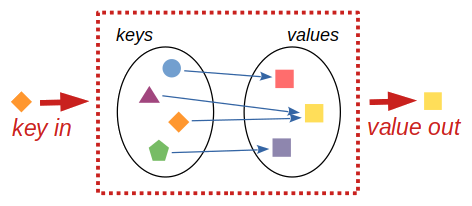

# Dictionaries

Another basic data type which we will introduce is the
*dictionary*, or short, `dict`.

Dictionary is a data structure consisting of multiple *key/value* pairs,
mapping *keys* to their corresponding *values*.

Its main purpose is to find quickly and efficiently a value for a given key.

Python constraints what dictionary *keys* can be.
The keys must not repeat (one key cannot map to two different values)
and must not be changeable (*mutable* values, such as lists and dictionaries
are therefore not allowed). Strings keys are the most common, though other
types such as numbers and tuples are also used.

The target *values*, as in the case of, e.g., lists, can by anything
which can be assigned to a variable. The values can repeat and multiple
keys can point to the same value.



There is a dictionary with 3 keys, and each one of them has a value:

```pycon
>>> me = {'name': 'Marketa', 'city': 'Prague', 'numbers': [20, 8]}
```

Note the curly braces `{}` and the colons `:` between each key and value.
The key/value pairs are separated by commas `,`.

> [note]
> **Are dictionaries ordered?**
> As of [Python 3.7](https://docs.python.org/3/whatsnew/3.7.html)
> officially (effectively
> [already from Python 3.6](https://docs.python.org/3/whatsnew/3.6.html#new-dict-implementation))
> dictionaries are guaranteed to preserve order in which their key/value pairs
> are inserted. Before, the ordering was not guaranteed, as it can be still
> found mentioned in older text books.

You can get values from the dictionary similar as
from lists, but instead of an index, you have to use a key.

```pycon
>>> me['name']
'Marketa'
```

If you try to access a non-existent key, Python won't like it:

```pycon
>>> me['age']
Traceback (most recent call last):
  File "<stdin>", line 1, in &lt;module&gt;
KeyError: 'age'
```

You can change the values of keys:

```pycon
>>> me['numbers'] = [20, 8, 42]
>>> me
{'name': 'Marketa', 'city': 'Prague', 'numbers': [20, 8, 42]}
```

... or add keys and values:

```pycon
>>> me['language'] = 'Python'
>>> me
{'name': 'Marketa', 'city': 'Prague', 'numbers': [20, 8, 42], 'language': 'Python'}
```

... or delete keys and values using the `del` command (also the same as for lists):

```pycon
>>> del me['numbers']
>>> me
{'name': 'Marketa', 'city': 'Prague', 'language': 'Python'}
```

Dictionaries in Python have a couple of useful methods which are good to know.

One of them is the `get` method which allows you to get a value for a key
when the key exists or return a default value when it does not exist:

```pycon
>>> record.get('name') # key exits and value is returned
'Peggy'
>>> record.get('age') # key does not exist and None is returned instead
>>> record.get('age', 'n/a') # key does not exist and 'n/a' is returned instead
'n/a'
```

Other useful method is `pop`, removing a key from the dictionary and
returning its value. `pop` throws an error in case of a missing
value, unless a default value is provided:

```pycon
>>> record.pop('name') # 'name' is removed from dictionary
'Peggy'

>>> record.pop('name')
Traceback (most recent call last):
  File "<stdin>", line 1, in <module>
KeyError: 'name'

>>> record.pop('name', None)  # None is returned

>>> record.pop('name', 'n/a') # 'n/a' is returned
```

The `update` method updates a dictionary from another one (rewrites existing
and adds new keys):

```pycon
>>> record
{'city': 'Prague', 'name': 'Lucy'}

>>> record.update({'name': 'Peggy', 'hobby': 'Python programming'})
'Lucy'

>>> record
{'city': 'Prague', 'name': 'Peggy', 'hobby': 'Python programming'}

```

## Lookup table

A use of dictionaries other than data clustering is the
so-called *lookup table*.
It stores values of same type.

This is useful for example with phone book.
For every name there is one phone number.
Other examples are dictionaries with properties of food, or word translations.


```python
phones = {
    'Tyna': '153 85283',
    'Lubo': '237 26505',
    'Andreea': '385 11223',
    'Fabian': '491 88047',
    'Vitoria': '491 88047',
    'Oliwia': '491 88047',
}

colours = {
    'pear': 'green',
    'apple': 'red',
    'melon': 'green',
    'plum': 'purple',
    'radish': 'red',
    'cabbage': 'green',
    'carrot': 'orange',
}
```

Update Lubo's number to be the same as Fabian's as they now temporarily share phones.


```python
phones["Lubo"] = phones["Fabian"]
print(phones)
```


## Iteration

When you loop over a dictionary using `for`, you will get only keys:

```pycon
>>> func_descript = {'len': 'length', 'str': 'string', 'dict': 'dictionary'}
>>> for key in func_descript:
...     print(key)
str
dict
len
```

If you want to access the values, you will have to use the method `values`:

```pycon
>>> for value in func_descript.values():
...     print(value)
string
dictionary
length
```

But in most cases, you will need both -- keys and values.
For this purpose, dictionaries have the method `items`.

```pycon
>>> for key, value in func_descript.items():
...     print('{}: {}'.format(key, value))
str: string
dict: dictionary
len: length
```

> [note]
> There is also the method `keys()` which returns just keys.
>
> `keys()`, `values()` and `items()` return special objects
> which can be used in `for` loops (we say that those objects are "iterable"),
> and they behave as a set.
> This is well described in the [documentation](https://docs.python.org/3/library/stdtypes.html#dictionary-view-objects)

In a `for` loop, you can't add keys to a dictionary nor delete them:

```pycon
>>> for key, value in func_descript.items():
...     func_descript[key.upper()] = value.upper()
Traceback (most recent call last):
  File "<stdin>", line 1, in <module>
RuntimeError: dictionary changed size during iteration

>>> for key in func_descript:
...     del func_descript[key]
Traceback (most recent call last):
  File "<stdin>", line 1, in <module>
RuntimeError: dictionary changed size during iteration
```

This limitation can be easily overcome by using a list copy
of the iterator:

```pycon
>>> for key, value in list(func_descript.items()):
...     func_descript[key.upper()] = value.upper()
>>> func_descript
{'len': 'length', 'str': 'string', 'dict': 'dictionary', 'LEN': 'LENGTH', 'STR': 'STRING', 'DICT': 'DICTIONARY'}

>>> for key in list(func_descript):
...     del func_descript[key]
>>> func_descript
{}
```

However, you can change values for already existing keys.

Update the `phones` dictionary so that all numbers contain a '+43' prefix.


```python
for person in phones:
    phones[person] = f'+43{phones[person]}'
print(phones)
```



Using a `for` loop, ensure that following `keys_to_delete` are deleted from the dictionary `phones`.

```python
keys_to_delete = ['Lubo', 'Tyna', 'Oliwia']
```


```python
for to_delete in keys_to_delete:
    # need to check if is present - cannot delete a key which does not exist in dictionary
    if to_delete in phones.keys(): # or to_delete in phones:
        del phones[to_delete]
print(phones)
```



## How to create a dictionary

Dictionaries can be created in two ways.
The first way uses curly brackets `{}`.
The other way is by using the keyword `dict`.
This works similar to `str`, `int` or `list`, so it will
convert some specific objects to a dictionary.

```pycon
>>> {}  # empty dictionary
{}
```

```pycon
>>> dict()  # empty dictionary
{}
```

```python
colours = {
    'pear': 'green',
    'apple': 'red',
    'melon': 'green',
    'plum': 'purple',
    'radish': 'red',
    'cabbage': 'green',
    'carrot': 'orange',
}
```

You can fill a new dictionary from one or more existing ones:
```python
new_colours = {
    **colours,          # ** unpacks dictionary into key-value pairs
    'celery': 'green',
    'squash': 'yellow',
    'plum': 'purple',
}
```

It is possible to convert a dictionary into *another dictionary*.
This new dictionary won't be in any way connected to the
old one.

```python
colour_riped = dict(colours)
for key in colour_riped:
    colour_riped[key] = 'blackish-brownish-' + colour_riped[key]
print(colours['apple'])
print(colour_riped['apple'])
```

We can also convert a sequence of *pairs* (e.g., list of tuples)
(which work as *key* and *value*) into a dictionary:

```pycon
>>> data = [(1, 'one'), (2, 'two'), (3, 'three')]
>>> dict(data)
{1: 'one', 2: 'two', 3: 'three'}

>>> data = [[1, 'one'], [2, 'two'], [3, 'three']]
>>> dict(data)
{1: 'one', 2: 'two', 3: 'three'}
```


## Dictionaries and function keyword arguments - *args **kwargs

`*args` and `**kwargs` allow you to pass multiple arguments or keyword arguments to a function.

If you do not know how many arguments will be passed into your function, or you do not really care,
add a `*` before the parameter name in the function definition.

`**kwargs` allows us to pass a variable number of keyword arguments to a Python function.
In the function, we use the double-asterisk before the parameter name to denote this type of argument.

`args` are collected in a function always as tuples, while `kwargs` are collected as dictionaries.


```pycon
>>> def test(*args, **kwargs):
...     print("args:", args)
...     print("kwargs:", kwargs)

>>> test(1, 2, 3, a="Hi Bob!", b=True)
args: (1, 2, 3)
kwargs: {'a': 'Hi Bob!', 'b': True}
```

Example of real-life usage of `*args` could be for example:

```pycon
>>> def my_sum(*args):
...     result = 0
...     for x in args:
...         result += x
...     return result

>>> print(my_sum(1, 2, 3))
6
```

## Exercise

We have this dictionary of computer access information of two users and another lookup table with cities information.
```python
users = {
  'aeinstein': {
    'first': 'albert',
    'last': 'einstein',
    'location': 'princeton',
    'email': 'albgenious1@princeton.org',
  },
  'mcurie': {
    'first': 'marie',
    'last': 'curie',
    'location': 'paris',
  },
}

cities = {
  'paris': {
    'country': 'France',
    'population': 2161,
  },
  'london': {
    'country': 'Great Britain',
    'population': 8960,
  },
  'princeton': {
    'country': 'United States of America',
    'population': 28,
  }
}
```
Print out following information about each user if they have it:
Their `'username'`, `'full name'` (first and last with first letter capitalized), `'email'`, `'city'` they live in and `'country'` they live in.


```python
for username, properties in users.items():
    fullname = f'{properties["first"][0].upper()}{properties["first"][1:]} {properties["last"][0].upper()}{properties["last"][1:]}'
    # or properties["first"].capitalize()
    if "email" in properties:
        email = properties["email"]
    else:
        email = None
    city = properties["location"]
    if properties["location"] in cities:
        country = cities[properties["location"]]["country"]
    else:
        country = None
    print(f'''
    User with username: "{username}"
    is named: "{fullname}",
    has email: "{email}",
    lives in "{city}",
    which is located in "{country}"
    ''')
```



## And that's all for now

If you would like to know all the tricks
about dictionaries you can look at the [cheatsheet](https://github.com/ehmatthes/pcc/releases/download/v1.0.0/beginners_python_cheat_sheet_pcc_dictionaries.pdf).

If you want to demystify the `*args` and `**kwargs` and learn more than we could fit in the lecture, have a look [here](https://realpython.com/python-kwargs-and-args/).

A complete description can be found here in the
Python [documentation](https://docs.python.org/3/library/stdtypes.html#mapping-types-dict).
