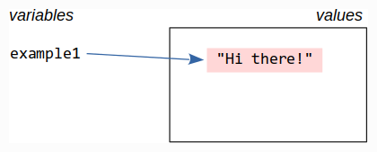

You have recently learned about Python lists, the first *mutable* data type
taught in this beginners course. Before we move on to its *immutable* counterpart,
let's have a closer look what the *mutability* actually means.


# What Is Mutability and Why Does It Matter

The *mutability* is a property of a data type telling us whether a value
of this data type can change (mutate) in the course of its existence.

Data types can be either *immutable* or *mutable*.

Values of *immutable* data types stay as they were created and cannot
change - mutate - in some other value. Immutable types in Python are. e.g.,
Booleans (`True`, `False`), numbers, strings, tuples.

On the other hand, values of *mutable* data type can mutate in some other values.
Mutable types in Python are. e.g., lists, dictionaries, sets.

Sounds simple, right? Let's see them in detail.


## Immutable Data Types

Let's start with an example of an immutable data type -
string. Let's create a value and see what is Python doing:

```pycon
>>> example1 = "Hi there!"
```

With this command you created a new string (`"Hi there"`)  and assigned it
to a variable. Easy! You have done that many times already.

Now, what is actually Python doing is, first, it creates a new value,
a string object, and stores in the computer memory and, second, it stores
a *reference* to this value into a variable (`example1`).



What is a *reference*? In simple words, it is a link to the value stored
somewhere in the computer memory. Were and how exactly is stored is not our
concern right now.


Let's see what happens when we assign the value held in our variable
to another variable like:

```pycon
>>> example2 = example1
```

In this assignment, Python takes the reference from the `example1`
variable and copies it into `exampled2`. It does not copy the referenced
value though.


How do we check it? Let's compare the actual values first:

```pycon
>>> example2 == example1
True
```

Okay, if variables point to the same string object it must be equal,
but is it really they the same string object? Let's check it with the
[Python `is` operator](https://docs.python.org/3/reference/expressions.html#is):

```pycon
>>> example2 is example1
True
>>>
```

They are. Since the assignment copied a reference to the same string object,
both variables refer to the same value (string object).

Now, see what happens if we create a new string rather than a reference to
an existing one:

```pycon
>>> example3 = "Hi there!"
>>> example3 == example1
True
>>> example3 is example1
False
```

In this case, a new string object is created and its reference is stored
in the `example3` variable. The strings to which this variable refers
is equal to the one referred by `example1` but it is not the same one
(two equal strings occupying two different places in the computer memory).


All right, this is an interesting detail, but why should we really care?

Well, the nice thing is that **with *immutable* data types we do not need to care**.
Do you remember what we said before? Immutable values stay as they are and they
cannot change (mutate) into something else.

To see the difference, let's repeat the same experiment with a mutable data type.


## Mutable Data Types

We try the same experiment with a *mutable* data type. Let's create a list
and assign it to a variable:

```pycon
>>> example1 = [1, 2, 3]
```

We already know what is happening. Python creates a new list object and store
its reference into a variable.


> [note]
> Note that the list elements are references too, just like the variables.

Let's move to the next step and copy the content of `example1` into a new
variable `example2`:

```pycon
>>> example2 = example1
>>> example2 == example1
True
>>> example2 is example1
True
```

So far so good, `example2` contains a reference to the same list object
as `example1`.


Let's create a new list and store in the `example3` variable:

```pycon
>>> example3 = [1, 2, 3]
>>> example3 == example1
True
>>> example3 is example1
False
```

All right, nothing new, a new list object is created and its reference
is stored in `example3`. This list is equal to the one referenced by `example1`
but the referenced objects are different.


Now, let's mutate the list referenced by the `example2` variable by appending
a new element to the list:

```pycon
>>> example2.append(4)
>>> example2
[1, 2, 3, 4]
```

... and check what it is in the other variables

```pycon
>>> example1
[1, 2, 3, 4]
>>> example3
[1, 2, 3]
```

All of the sudden, `example1` holds a "different" list than we assigned to it.
But we did not touch the `example1` variable!

It will start making sense when we recall that variables in Python hold
references to values, list objects in this case, rather than copies of the values.


The `example1` and `example2` variables refer the same list object and
when we change the object through one of the variables it changes also
for the other one. And **this might be a problem if we do not pay attention with
the *mutable* values**.

This is a simple obvious example but in real life this might get less clear.
In Python, the references to values are passed not just when we assign values
to variables but also when we pass arguments to functions or add elements
to list and other composed data types. Or, in other words, **Python does not
copy the mutable values unless we do it ourselves**.

> [note]
> In case of composed data types, we distinguish so called *shallow* and
> *deep* copy. A *shallow copy* copies just the topmost object leaving the nested
> references unchanged. A *deep copy* copies also the nested objects.
>
> You can explicitly request a (shallow) copy, e.g., by using
> `list(<existing list>)`.
>
> For more details see
> [`copy` documentation](https://docs.python.org/3/library/copy.html)

Mutable data types as, e.g, lists are very useful but may lead to undesired
side effects and shall be used with care.

There are also cases where mutable values are forbidden such as the keys
in *dictionaries* or *sets* (worry not, you will learn about them later).


## A Less Obvious Example

Let's continue with a more complex example where mutability may lead to
an undesired side effect.

Let's create a 10-by-10 "table" created from lists holding simple character
values and a function printing the table in a nice form

```python

def print_table(table):
    for row in table:
       print(" ".join(row))

def create_blank_table(n_rows, n_columns, fill_character="."):
    row = [fill_character] * n_columns
    table = []
    for _ in range(n_rows):
        table.append(row)
    return table

table = create_blank_table(10, 10)

print_table(table)
```

> [note]
> There is an error in the code. Can you find where? If not, don't worry
> and keep reading ...

The creation looks elegant and simple. The output looks like

```
. . . . . . . . . .
. . . . . . . . . .
. . . . . . . . . .
. . . . . . . . . .
. . . . . . . . . .
. . . . . . . . . .
. . . . . . . . . .
. . . . . . . . . .
. . . . . . . . . .
. . . . . . . . . .
```

The table creation clearly works and produces a list of 10 lists,
each of them having 10 elements. Now, let's edit the table and fill it
with some new content.

We would like to change elements of the table so that the
output looks like this (row 2, column 4 set to `X` and row 5, column 5 set to `O`)

```
. . . . . . . . . .
. . . X . . . . . .
. . . . . . . . . .
. . . . . . . . . .
. . . . O . . . . .
. . . . . . . . . .
. . . . . . . . . .
. . . . . . . . . .
. . . . . . . . . .
. . . . . . . . . .
```

Since you know how to change elements of nested arrays try it yourself



This is the way how to do it
```python

table = create_blank_table(10, 10)
table[1][3] = "X"
table[4][4] = "O"
print_table(table)
```

But the result looks different than we expected

```
. . . X O . . . . .
. . . X O . . . . .
. . . X O . . . . .
. . . X O . . . . .
. . . X O . . . . .
. . . X O . . . . .
. . . X O . . . . .
. . . X O . . . . .
. . . X O . . . . .
. . . X O . . . . .

```

You did the right thing, but the result looks wrong, doesn't it? What is going on?!

There is obviously an error. But where? Look at the function again and try to
guess.

```python
def create_blank_table(n_rows, n_columns, fill_character="."):
    row = [fill_character] * n_columns
    table = []
    for _ in range(n_rows):
        table.append(row)
    return table
```



Right, each row of is the same list object. By editing one them, you edit all of
them.

But how to generate the table in a safe way? Any idea?




The function creating a blank table needs to be corrected, e.g., like this

```python
def create_blank_table_corrected(rows, columns, fill_character="."):
    table = []
    for _ in range(n_rows):
        row = [fill_character] * n_columns
        table.append(row)
    return table
```

Let's run the code with the corrected function and see the result

```python
table = create_blank_corrected(10, 10)
table[1][3] = "X"
table[4][4] = "O"
print_table(table)
```

Now, each row is a different is object and the result is correct.
```
. . . . . . . . . .
. . . X . . . . . .
. . . . . . . . . .
. . . . . . . . . .
. . . . O . . . . .
. . . . . . . . . .
. . . . . . . . . .
. . . . . . . . . .
. . . . . . . . . .
. . . . . . . . . .
```


## Conclusion

I hope this chapter helped you better understand what the data type *mutability*
means.

We cannot say that *immutable* types are always better than the *mutable*
ones, or the other way around. Both have their place in Python.

But remember that multiple references to *mutable* values may lead to
unexpected side effects and strange errors.
